# HireIQ

**AI-powered recruitment platform for evaluating candidates against job criteria.**

🔗 **Live demo:** [hire-iq-two-ashy.vercel.app](https://hire-iq-two-ashy.vercel.app/)

---

## The problem

Recruiters and hiring managers spend hours manually screening resumes against job requirements — a repetitive process that's easy to get wrong under time pressure. HireIQ helps recruiters define what actually matters for a role, then quickly evaluates candidates against those criteria so they can focus their time on the strongest matches.

## What it does

HireIQ lets a recruiter:

1. **Create job roles** with a title, description, and seniority level
2. **Define evaluation criteria** per role — required skills, preferred skills, minimum years of experience, experience level, and custom criteria — with keyword-based skill suggestions to speed this up
3. **Add candidates** by pasting CV text or uploading a PDF resume (auto-extracted)
4. **Run AI evaluations** that score each candidate against the role's criteria, returning a score out of 100, a summary, matched/missing skills, interview focus areas, and a recommendation
5. **Browse evaluation history**, re-evaluate a candidate using their latest saved CV/role data, and filter by candidate name, role, or recommendation
6. **Compare multiple candidates** side-by-side, ranked by score
7. **Track activity** across the account (roles created, candidates added, evaluations run, etc.)
8. **Manage account settings** — update display name, change password, change email (with verification), sign out

## Features

- 🔐 Authentication with Supabase Auth
- 📋 Role management with duplicate-title checking
- 🧩 Flexible, JSONB-based evaluation criteria with skill-pill inputs and smart suggestions
- 📄 PDF resume parsing via `pdfjs-dist`
- 🤖 AI-style candidate scoring (currently rule-based mock scoring, designed to be swapped for a real LLM call)
- 🔁 One-click re-evaluation using live candidate/role data
- 🔍 Search, filter, and pagination ("Load more") across candidates and evaluations
- ⚖️ Side-by-side candidate comparison
- 🕓 Full activity log
- 🎛️ Consistent loading, error, and empty states across every data-driven page
- 🔔 Toast notifications instead of native browser alerts
- 👤 Avatar upload, display name, password, and email management

## Tech stack

| Layer | Technology |
|---|---|
| Framework | [Next.js](https://nextjs.org/) (App Router) |
| Language | TypeScript |
| Styling | Tailwind CSS |
| Backend / Database | [Supabase](https://supabase.com/) (Postgres, Auth, Storage) |
| AI scoring | Rule-based mock scoring (OpenAI integration planned) |
| Deployment | [Vercel](https://vercel.com/) |

## Project structure (high level)

```
app/
  dashboard/            # Overview + stats
  roles/                # Create role, criteria, roles list
  candidates/            # Add candidate, candidates list, compare
  evaluations/          # Evaluation history
  settings/             # Account settings
  api/evaluate/          # Scoring endpoint
lib/
  evaluateCandidate.ts   # Shared evaluation logic
  criteria.ts            # Shared criteria fetch/check logic
  evaluation/            # Scoring engine
components/
  ui/                    # Toast, LoadingSpinner, Card
  layout/                # Sidebar, Header, DashboardLayout
```

## Getting started locally

### Prerequisites

- Node.js 18+
- A [Supabase](https://supabase.com/) project (free tier is fine)

### 1. Clone and install

```bash
git clone https://github.com/<your-username>/hireiq.git
cd hireiq
npm install
```

### 2. Set up environment variables

Create a `.env.local` file in the project root:

```
NEXT_PUBLIC_SUPABASE_URL=your-supabase-project-url
NEXT_PUBLIC_SUPABASE_ANON_KEY=your-supabase-anon-key
```

### 3. Set up the database

In your Supabase project, create the following tables (with Row Level Security enabled):

- `roles`
- `criteria`
- `candidates`
- `evaluations`
- `activity_log`

Create an `avatars` storage bucket for profile photos.

### 4. Run the dev server

```bash
npm run dev
```

Visit `http://localhost:3000`.

## Demo video

> _Paste your GitHub-hosted video embed link here once uploaded._

## Screenshots

**Login**
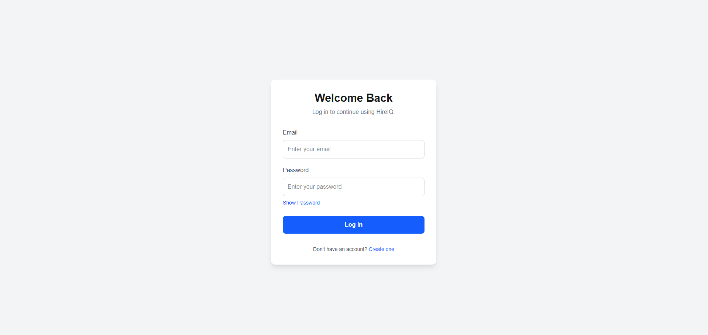

**Sign up** — live password strength requirements
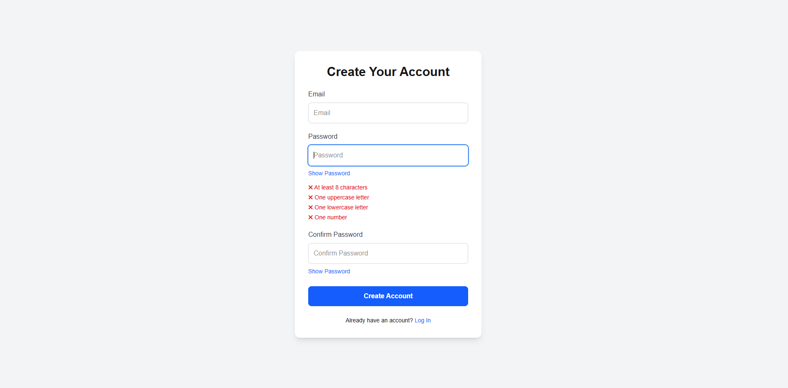

**Dashboard** — live stats and quick actions
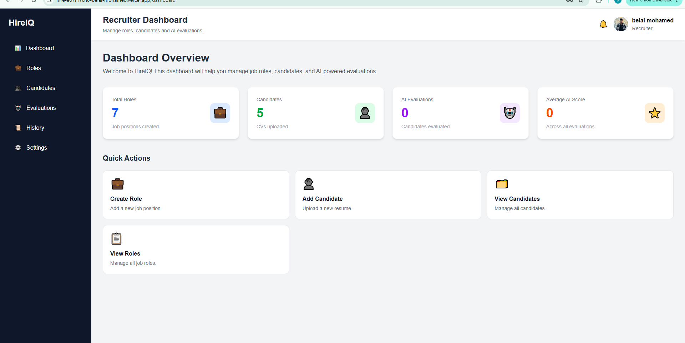

**Create a role**
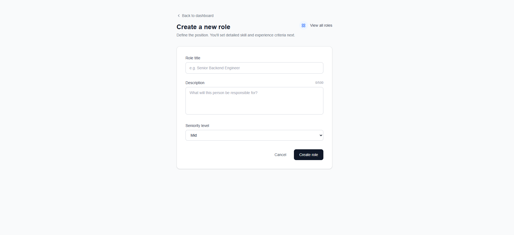

**All roles**
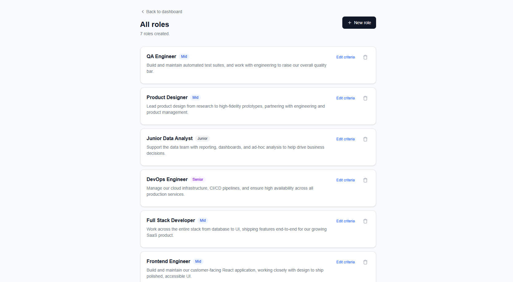

**Add a candidate** — paste CV text or upload a PDF
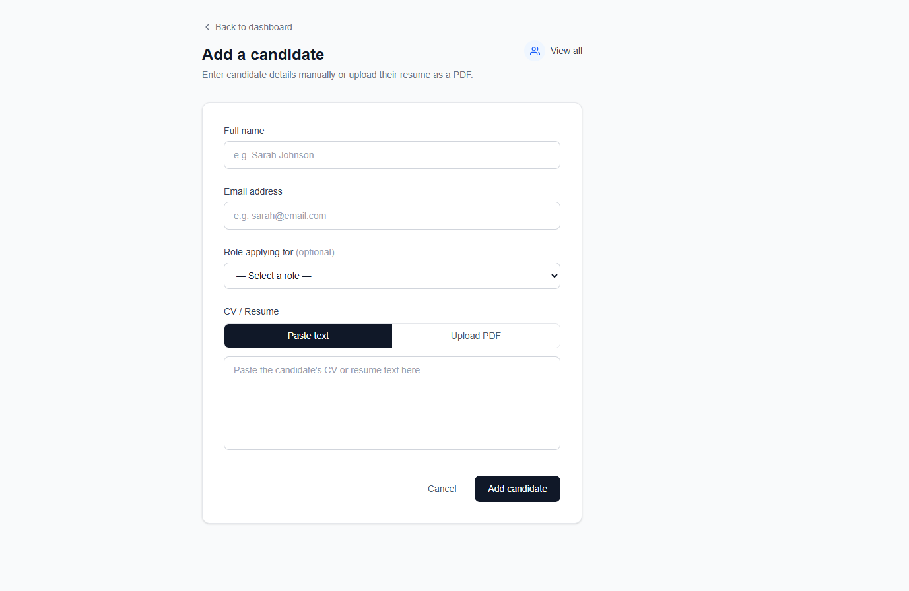

**All candidates**
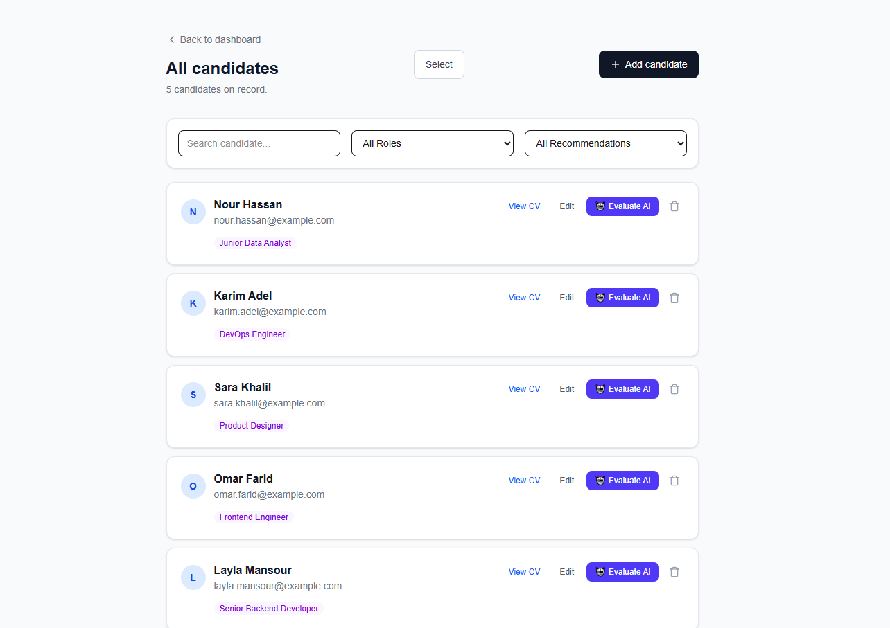

**AI evaluation — weak match example**
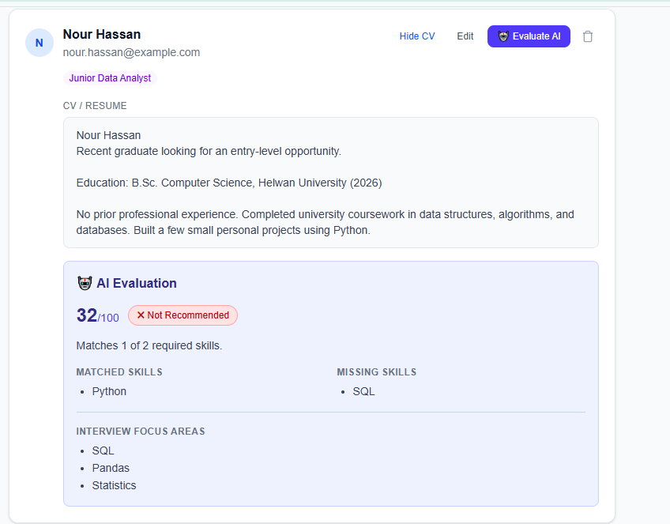

**AI evaluation — strong match example**
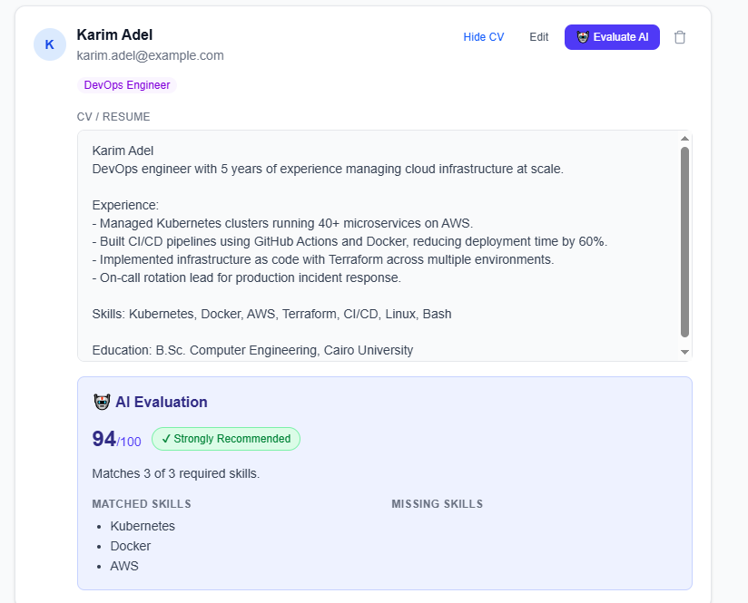

**Selecting candidates to compare**
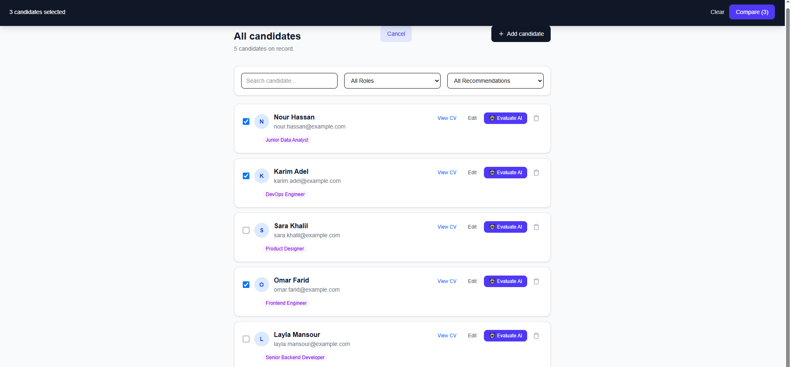

**Compare candidates side-by-side**
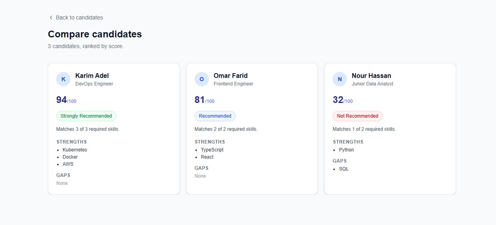

**Evaluation history** — search, filter, and re-evaluate
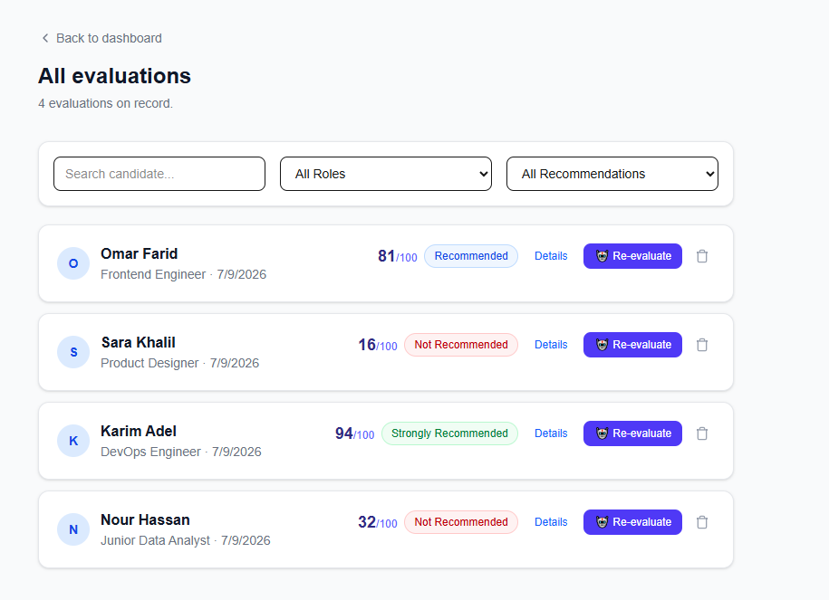

**Activity history**
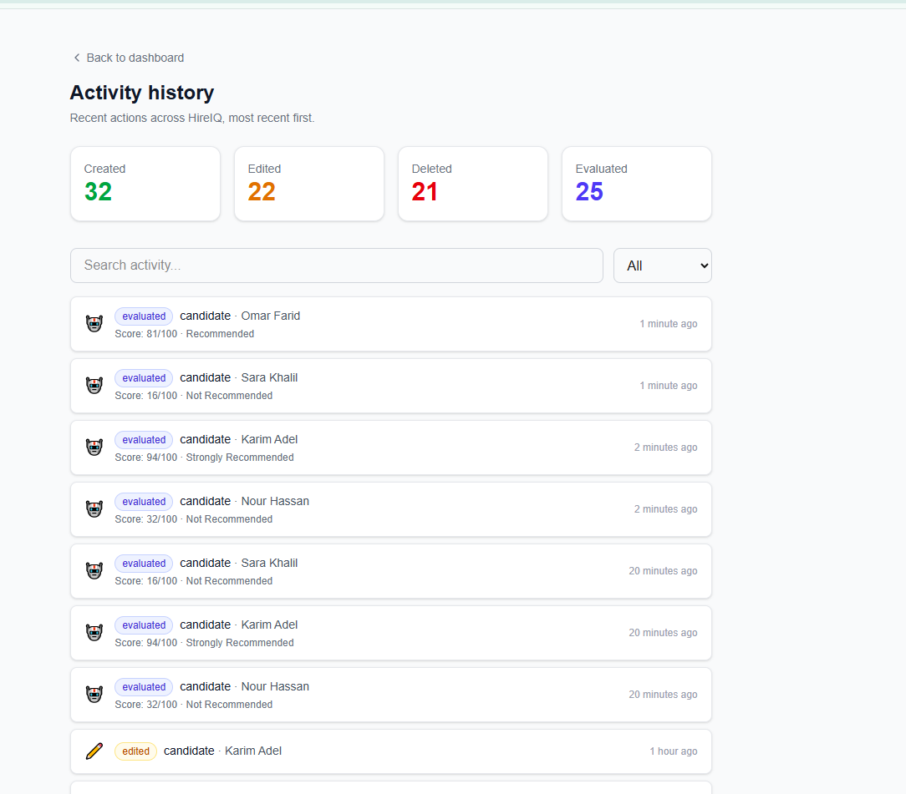

**Settings** — display name, password, and account controls
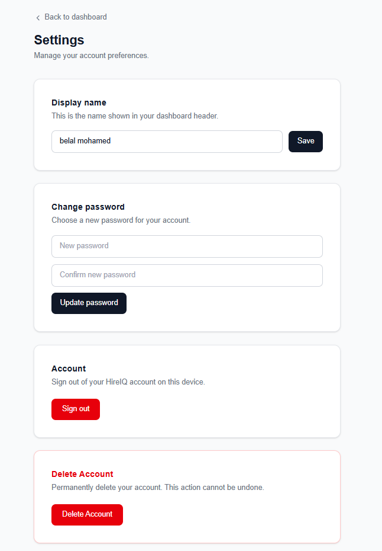

## Roadmap

- [ ] Delete account flow
- [ ] Wire up real LLM-based scoring (OpenAI)
- [ ] Server-side search and pagination at scale
- [ ] Team/multi-recruiter support

## License

This project was built as a portfolio piece. Feel free to explore the code for learning purposes.